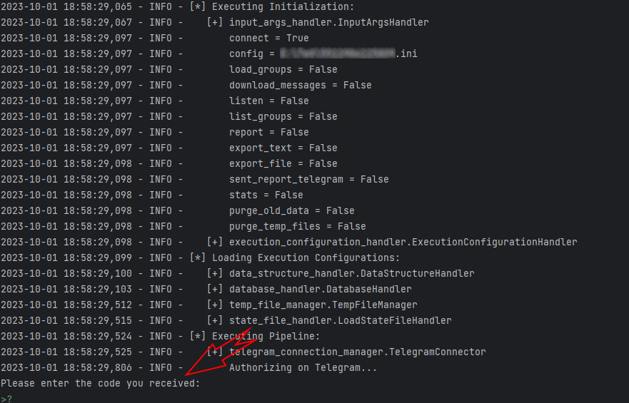
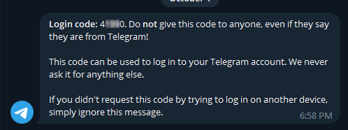

# Authentication

If you are asked to provide an additional authentication during the first connection, the Telegram Explorer Runner will ask on prompt/tty and waits until you provide the authentication challenge response.

**Code Request**

**Authentication Code sent to Telegram Account**

