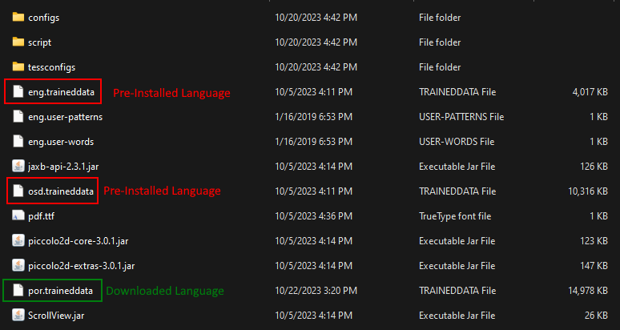

# Configuration - OCR

Using Tesseract, Telegram Explorer does OCR and extract all texts from any downloaded images.

By default, Tesseract comes with 2 languages, English and OSD, but you can install additional languages as you wish.


!!! warning "OCR Results"
    
    Remember, OCR are not magical thing and the results may vary, especially in the wild enviroment like analize any, uncontrolled, multiple sources, unstandarized, downloaded images from any kind of Telegram groups.

```ini
[OCR]
enabled=true
type=tesseract

[OCR.TESSERACT]
tesseract_cmd=/path/to/tesseract/cmd
language=eng
```

* **enabled** > Required - Enable/Disable OCR Feature (true = enable / false = disable) 
* **type** > Required - Engine Type (fixed=tesseract)
* **tesseract_cmd** > Required - Path to Tesseract CMD
* **language** > Required - Tesseract Language, multiple Languages supported (Ex: eng+por)

## OCR Text

All extracted content is combined with the original content of the messages, so Telegram Explorer's search and notification mechanisms work seamlessly.

Here's a real message example:

```
Yeah, we got compromised by APT29, but luckily MalwareBytes™ FREE AV 
stopped the infection in their tracks! 

To be extra safe, we swung by the local Hotel and used their 
WiFi to install it.

====OCR CONTENT====

Malwarebytes 4.0
Premium
Real-Time Protectin

My Computer Global

17 total

Malicious sites 2
Malware PUPs 3
Ransomware 1
Explits 9
```


## Installing Tesseract

* **Linux Users**: Follow the "Installation" procedures at [https://tesseract-ocr.github.io/tessdoc/Installation.html](https://tesseract-ocr.github.io/tessdoc/Installation.html)
* **Windows Users**: Get and Install from [https://github.com/UB-Mannheim/tesseract/wiki](https://github.com/UB-Mannheim/tesseract/wiki)

## Adding New Languages

Installing new languages are simple as download trained data for the new language and copy the downloaded file to **tessdata** folder into Tesseract installation folder.

To obtain the languages, access [https://github.com/tesseract-ocr/tessdata](https://github.com/tesseract-ocr/tessdata)

As an example, that are my *tessdata* directory:

