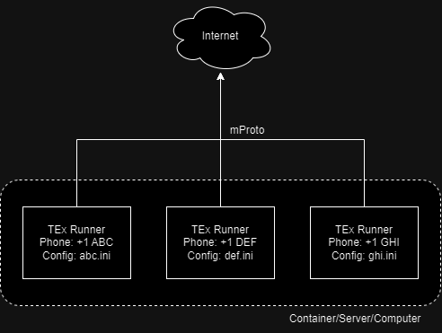

# Welcome to Telegram Explorer

[](https://github.com/guibacellar/TEx/tree/main)
[](https://github.com/guibacellar/TEx/tree/main)
[](https://www.python.org/downloads/)
[](https://theobservator.net/)
[](https://github.com/guibacellar/TEx/actions/workflows/cy.yml)
[](https://telegramexplorer.readthedocs.io/en/latest/)

<!-- ABOUT THE PROJECT -->
## About The Project

TEx is a Telegram Explorer tool created to help Researchers, Investigators and Law Enforcement Agents to Collect and Process the Huge Amount of Data Generated from Criminal, Fraud, Security and Others Telegram Groups.

<!-- REQUIREMENTS -->
## Requirements
- Python 3.8.1+
- Windows x64 or Linux x64

<!-- FEATURES -->
## Features
- Connection Manager
- Group Information Scrapper
- List Groups
- Automatic Group Information Sync
- Automatic Users Information Sync
- Messages Listener
- Messages Scrapper
- Download Media
- HTML Report Generation
- Export Downloaded Files
- Export Messages

<!-- HOW WORKS -->
## How Telegram Explorer Works
Telegram Explorer works using one configuration file per target phone number to be used. 



So, you can deploy 1 or several Telegram Explorer runners in one machine, using on configuration file for each instance. You also can deploy the runner using Linux Containers or Docker containers.

> ⚠️ **IMPORTANT**⚠️ </br></br> Depending on the security level and your account settings, you may be asked to enter a security code that will be sent to your Telegram, or some authentication information. </br></br>This way, the application will ask (only at the time of the first connection) for you to enter this value in the terminal (TTY).

<!-- INSTALLING -->
## Installing
Telegram Explorer is available through *pip*, so, just use pip install in order to fully install TeX.

```bash
pip install TelegramExplorer
```
