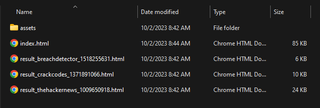
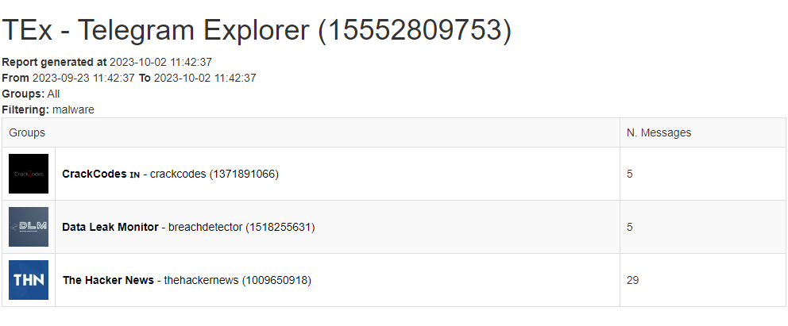
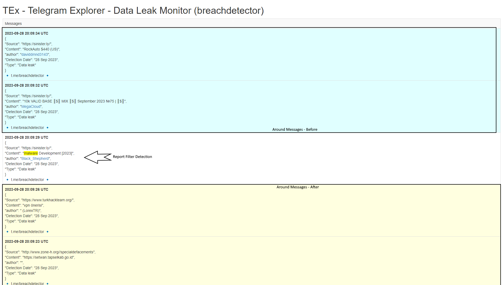

# Generate Report - HTML

Telegram Explorer allow you to generate HTML report containing messages, assets (images, videos, binaries, etc) from groups. Also, you may specify groups, period and message filters to generate a more customized report.

**Full Command:**

```bash
python3 -m TEx report --config CONFIGURATION_FILE_PATH --report_folder REPORT_FOLDER_PATH --group_id 157841,55697,12542378 --around_messages NUM --order_desc --limit_days 3 --filter FILTER_EXPRESSION_1,FILTER_EXPRESSION_2,FILTER_EXPRESSION_N
```

**Basic Command:**

```bash
python3 -m TEx report --config CONFIGURATION_FILE_PATH --report_folder REPORT_FOLDER_PATH --order_desc --limit_days 3 --filter Malware,BitLocker
```
**Parameters**

  * **config** > Required - Created Configuration File Path
  * **report_folder** > Required - Defines the Report Files Folder
  * **group_id** > Optional - If present, Download the Messages only from Specified Groups ID's
  * **around_messages** > Optional - Number of messages around (Before and After) the Filtered Message
  * **order_desc** > Optional - If present, sort all messages descending. Otherwise, sort Ascending.
  * **limit_days** > Optional - Number of Days of past to filter the Messages
  * **filter** > Optional - Simple (Comma Separated) String Terms Filter. Ex: hacking,"Car Hacking",foo
  * **suppress_repeating_messages** > Optional - If present, suppress all repeating messages in the same report

*Output Example:*

*Report Folder*


*Report Index*


*Report Group Detail*
