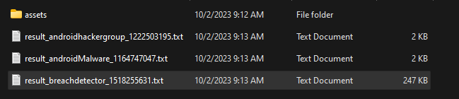
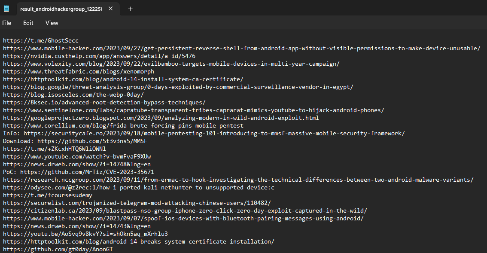

# Generate Report - Text

Telegram Explorer allow you to export Text content based on Regular Expression Extractors.

This way, you can generate simple outputs containing any type of information present on messages.

**Full Command:**

```bash
python3 -m TEx export_text --config CONFIGURATION_FILE_PATH --order_desc --limit_days 3 --regex REGEX_CAPTURE_GROUP --report_folder REPORT_FOLDER_PATH --group_id 12547,1256698
```

**Basic Command:**

```bash
python3 -m TEx export_text --config CONFIGURATION_FILE_PATH --limit_days 3 --regex REGEX_CAPTURE_GROUP --report_folder REPORT_FOLDER_PATH
```
**Parameters**

  * **config** > Required - Created Configuration File Path
  * **report_folder** > Required - Defines the Report Files Folder
  * **group_id** > Optional - If present, Download the Messages only from Specified Groups ID's
  * **limit_days** > Optional - Number of Days of past to filter the Messages
  * **regex** > Required - Regex Capture Group to find the messages. 
    * Ex: Export Links from Messages (http[s]?:\/\/[^\"\',]*)

*Output Example Using "(http[s]?:\/\/[^\"\',]*)" Regular Expression:*

*Report Folder*


*File Content*
